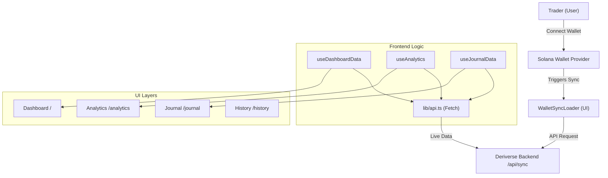
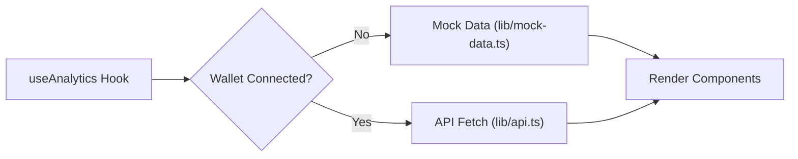

# Deriverse Trading Cockpit (Frontend)

## Reviewer Quick Start
- **Primary View**: `src/app/page.tsx` (Institutional Dashboard)
- **Data Orchestration**: `src/hooks/useDashboardData.ts` (Unified Hook)
- **Analytics Engine**: `src/hooks/use-analytics.tsx` (9 endpoint queries with demo/live switching)
- **Animation System**: `src/app/journal/page.tsx` (Framer Motion Staggering)
- **Live Sync**: `src/components/WalletSyncLoader.tsx` (Bootloader Aesthetic)

> **An institutional-grade trading dashboard for the Deriverse protocol, featuring real-time analytics, behavioral analysis, and high-fidelity trade journaling.**

This project is the frontend for the [Deriverse Trading Analytics](https://github.com/Fortexfreddie/deriverse_backend/blob/main/README.md) ecosystem. It provides a "War Room" aesthetic for Solana traders, transforming raw on-chain data into actionable institutional insights.

---

## Project Aim

The goal of this frontend is to provide:
1.  **Low-Latency Performance**: Rapid visualization of realized/unrealized PnL via optimized TanStack Query caching and unified data hooks.
2.  **Institutional Aesthetics**: A premium, "million-dollar" UI utilizing dark modes, glassmorphism, and micro-animations to drive user engagement.
3.  **Behavioral Visualization**: Transforming psychology audits (from backend) into interactive "Trade Dossiers" and archetypal visualizations.
4.  **Seamless Wallet Sync**: A high-touch "Bootloader" experience that handles the transition from sandbox/demo mode to live on-chain data.
5.  **Full API Coverage**: Every backend analytics endpoint is consumed and rendered — no data left unused.

---

## Pages & Features

### Dashboard (`/`)
The primary command center — aggregates KPI cards, live PnL chart, open positions table, and engine logs into a single high-density view.

### Analytics (`/analytics`)
Comprehensive risk and performance analytics with full backend integration:

| Section | Data Source | Description |
|---|---|---|
| **KPI Cards** | `/api/analytics/{wallet}` | Profit Factor, Expectancy, Win Rate |
| **Cumulative PnL Chart** | `/api/analytics/{wallet}/historical-pnl` | Area chart with realized + unrealized breakdown |
| **Drawdown Chart** | `/api/analytics/drawdown/{wallet}` | Max drawdown visualization with Sharpe & Sortino ratios |
| **Heatmap** | `/api/analytics/{wallet}/heatmap` | Calendar heatmap with daily PnL and trade drill-down |
| **Portfolio Composition** | `/api/analytics/{wallet}/composition` | Donut chart with dynamic color allocation |
| **Leaderboard** | `/api/analytics/leaderboard` | Global trader rankings |
| **Behavioral Metrics** | `/api/analytics/{wallet}/behavior` | Expectancy, profit factor, streaks, revenge trade detection, insights |
| **Market Metrics** | `/api/analytics/{wallet}` | Dynamic top-market breakdown (PnL, volume, win rate, fees) |
| **Session Performance** | `/api/analytics/{wallet}` | Asian / London / NY session PnL bars |
| **Equity Curve** | `/api/analytics/{wallet}/equity-curve` | Portfolio equity over time |
| **Time Analysis** | `/api/analytics/{wallet}/time-analysis` | Hourly and daily performance patterns |

### History (`/history`)
Trade history table with fill-level detail, position grouping, and inline journal submission via the Trade Detail Sidebar.

### Journal (`/journal`)
Interactive trade annotation interface. Submit notes, emotions, and ratings — the backend returns behavioral analysis, bias detection, trader profiling, macro context, and what-if scenarios. Results render in a "Trade Dossier" component.

### Settings (`/settings`)
Configuration panel for terminal behavior, risk protocols, and display preferences.

---

## Architecture

The frontend follows a modern **App Router** architecture with atomic components and centralized data hooks:



### Data Flow: Demo vs Live



All hooks follow the same pattern: when no wallet is connected, high-fidelity mock data is returned. On wallet connect, TanStack Query switches to live API fetching with stale-time caching and periodic refetching.

---

## API Endpoints Consumed

| Endpoint | Method | Hook |
|---|---|---|
| `/api/sync` | POST | `syncWallet()` |
| `/api/dashboard/{wallet}` | GET | `useDashboardData` |
| `/api/trades/{wallet}` | GET | `useDashboardData` |
| `/api/analytics/{wallet}` | GET | `useAnalytics` |
| `/api/analytics/{wallet}/historical-pnl` | GET | `useAnalytics` |
| `/api/analytics/leaderboard` | GET | `useAnalytics` |
| `/api/analytics/{wallet}/equity-curve` | GET | `useAnalytics` |
| `/api/analytics/drawdown/{wallet}` | GET | `useAnalytics` |
| `/api/analytics/{wallet}/time-analysis` | GET | `useAnalytics` |
| `/api/analytics/{wallet}/heatmap` | GET | `useAnalytics` |
| `/api/analytics/{wallet}/composition` | GET | `useAnalytics` |
| `/api/analytics/{wallet}/behavior` | GET | `useAnalytics` |
| `/api/journal/{positionId}` | PATCH | `submitJournal()` |

---

## Tech Stack

-   **Framework**: [Next.js 16](https://nextjs.org/) (App Router, Server Components)
-   **Logic**: [TypeScript](https://www.typescriptlang.org/)
-   **Styling**: [Tailwind CSS 4](https://tailwindcss.com/) with Custom Design Tokens
-   **Animations**: [Framer Motion](https://www.framer.com/motion/) (Staggered variants, spring transitions)
-   **Data Fetching**: [TanStack Query v5](https://tanstack.com/query/latest) (Caching, Auto-refetching)
-   **Charts**: [Recharts](https://recharts.org/) (Customized for institutional dark-mode aesthetics)
-   **Icons**: [Lucide React](https://lucide.dev/)
-   **Blockchain**: [@solana/wallet-adapter](https://solana.com/) (Multi-wallet support)

---

## Getting Started

### Prerequisites
-   **Node.js** >= 18.x
-   **pnpm** (preferred) or npm
-   **Deriverse Backend** running locally or accessible via URL

### 1. Installation

Clone the repository and install dependencies:

```bash
git clone https://github.com/Fortexfreddie/deriverse_frontend
cd deriverse-cockpit-3
pnpm install
```

### 2. Environment Configuration

Create a `.env.local` file in the root directory:

```env
NEXT_PUBLIC_API_URL="http://localhost:3001/api"
NEXT_PUBLIC_SOLANA_RPC="https://api.devnet.solana.com"
```

### 3. Start Development Server

```bash
pnpm dev
```

Open [http://localhost:3000](http://localhost:3000) to see the dashboard.

---

## Key Workflows

### 1. Wallet Synchronization
When a user connects their wallet, the app detects if the wallet data is cached on the backend. If not, it triggers the `WalletSyncLoader`—a terminal-inspired experience that provides feedback as the backend decodes blockchain logs and calculates historical performance.

### 2. Hybrid Demo Mode
The app features a robust "Sandbox" state. If no wallet is connected, it falls back to high-fidelity mock data, allowing users to explore the dashboard's features (Analytics, Journal, History) before committing their on-chain data.

### 3. Trade Journaling
In the Journal page, traders can annotate their performance with notes, emotions, and ratings. The frontend sends these to the backend, which correlates them with market sentiment and execution metrics to produce behavioral analysis — detecting biases like FOMO or Revenge Trading and visualizing them with dynamic archetypes in a Trade Dossier.

### 4. Behavioral Analysis
The Analytics page surfaces behavioral metrics from the `/behavior` endpoint — including streak tracking, revenge trade detection, risk/reward ratios, and pattern-based insights. These help traders identify and correct destructive patterns.

---

## External Resources

-   **Backend Repository**: [Deriverse Trading Analytics Backend](https://github.com/Fortexfreddie/deriverse_backend/blob/main/README.md)
-   **API Documentation**: `http://localhost:3001/api-docs` (Swagger)

---

## License

[ISC](LICENSE)
